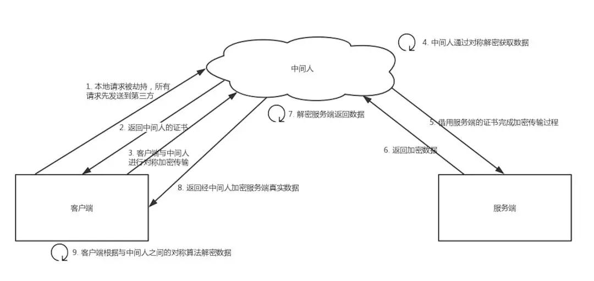
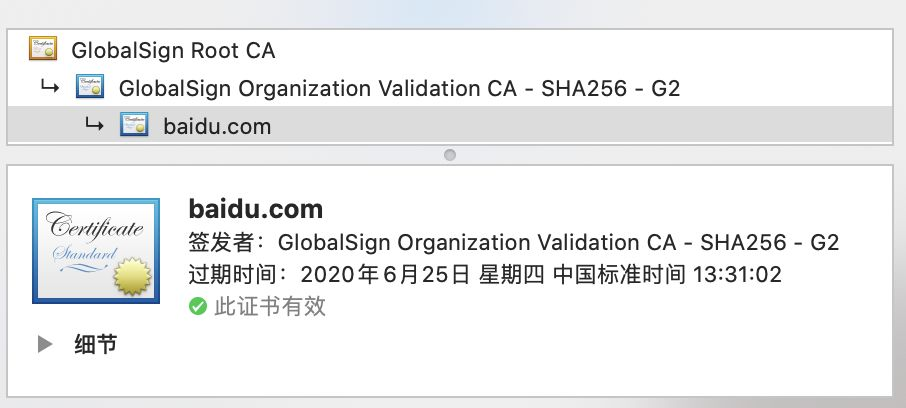

> 专栏原创出处：[github-源笔记文件 ](https://github.com/GourdErwa/review-notes/tree/master/algorithm/network) ，[github-源码 ](https://github.com/GourdErwa/java-advanced/tree/master/java-network)，欢迎 Star，转载请附上原文出处链接和本声明。

计算机网络理论专栏系列笔记，系统性学习可访问个人复盘笔记-技术博客 [计算机网络 ](https://review-notes.top/algorithm/network)

[[toc]]

> 文章作者: leapMie [原文链接](https://blog.leapmie.com/archives/418/#%E6%80%BB%E7%BB%93)

<!-- ## 为什么用了HTTPS就是安全的？
## HTTPS 的底层原理如何实现？
## 用了HTTPS就一定安全吗？ -->

## 网络

计算机网络(network)由若干结点(node)和连接这些结点的链路（link）组成。

所谓“上网”就是指“（通过某个ISP获得的IP地址）接入到因特网”

因特网交换点IXP(Internet eXchangePoint)的主要作用就是允许两个网络直接相连并交换分组，而不需要再通过第三个网络来转发分组

通常我们把要发送的整块数据称为一个报文(message)。

HTTPS的整体过程分为证书验证（非对称加密）和数据传输阶段（对称加密），具体的交互过程如下：

    

+ 证书验证阶段

1. 浏览器发起HTTPS请求
2. 服务端返回HTTPS证书
3. 客户端验证证书是否合法，如果不合法则提示告警

+ 数据传输阶段

1. 当证书验证合法后，在本地生成随机数
2. 通过公钥加密随机数，并把加密后的随机数传输到服务端
3. 服务端通过私钥对随机数进行解密
4. 服务端通过客户啊短传入的随机数构造对称加密算法，对返回结果进行内容加密后传输

### 1.为什么数据传输使用的是对称加密？

1. 首先，非对称加密的解密效率是非常低的，而http的应用场景中通常端与端之间存在大量的交互，非对称加密的效率是无法接受的

2. 另外，在HTTPS的场景中只有服务端保存了私钥，一对公私钥只能实现单向的加解密，所以HTTPS中内容传输加密来去的是对称加密，而不是非对称加密

### 2.为什么需要CA认证机构颁发证书？

HTTPS 协议被认为不安全是因为传输过程容易被监听者勾线监听、伪造服务器，而HTTPS协议主要解决的便是网络传输的安全性问题。

我们假设不存在认证机构，任何人都可以制作证书，这带来的安全风险便是经典中的“中间人攻击”问题。

具体工程如下：

    

过程原理：

1. 本地请求被劫持（如DNS劫持），所有请求均转发到中间人的服务器
2. 中间人服务器返回中间人自己的证书
3. 客户端创造随机数，通过中间人证书的公钥对对技术加密后传送给中间人，然后凭借随机数构造对称加密对传输内容进行加密传输
4. 中间人因为拥有客户端的随机数，可以通过加密对称算法进行内容加密
5. 中间人以客户端的请求内容再向正规网站发起请求
6. 因为中间人与服务器的通信过程是合法的，服务器通过建立的安全通道返回加密后的数据
7. 中间人凭借与服务器建立的对称加密算法对内容进行加密
8. 中间人通过与客户端建立的对称加密算法对服务器返回的数据进行加密传输
9. 客户端通过与中间人建立的对称加密算法对返回结果进行解密

### 3.浏览器如何确保 CA 证书的合法性？

1. 证书包含什么信息？
+ 颁发机构的信息
+ 公钥
+ 公司信息
+ 域名
+ 有效期
+ 指纹
+ ...

2. 证书合法性依据是什么？

首先，权威机构是要有认证的，不是随便一个机构都可以颁发证书，不然也不叫权威机构。

其次，证书的可信性基于信任制，权威机构需要对其进行颁发的证书进行信用背书，只要是权威机构生成的证书，我们就认为是合法的。所以权威机构会对申请者的信息进行审核，不同等级的权威机构对审核的要求也不一样，于是证书分为免费的、便宜的、贵的。

3. 浏览器如何验证证书的合法性？

浏览器发起HTTPS请求时，服务器会返回网站的SSL证书，浏览器需要对证书做一下验证：

1. 验证域名、有效期等信息是否正确。证书上都有包含这些信息，比较容易完成验证
2. 判断证书来源是否合法。每份签发证书都可以根据验证链查找对应的根证书，操作系统、浏览器会在本地存储权威机构的根证书，利用本地根证书可以对对用机构签发证书完成来源验证

    

3. 判断证书是否被修改，需要与CA服务器进行校验
4. 判断证书是否已吊销，通过CRL（Certificate Revocation List证书注销列表）和OCSP（Online Certificate Status Prototal在线证书状态协议）实现，其中OCSP可以用于第三步中以尖山与CA服务器的交互，提高验证效率

**以上任意一部满足的情况下浏览器才认为证书是合法的。**

这里穿插一个问题：

既然证书是公开的，如果要发起中间人攻击，我在官网上下载一份证书作为我的服务器证书，那客户端肯定会认同这个证书的合法的，如何避免这种证书冒用的情况呢？

A: 其实这就是非对称加密的公私钥的用处，虽然中间人可以得到证书，但是私钥是无法获取的，一份公钥是不可能推算出其对应的私钥的。中间人即使拿到证书也违法伪装成合法服务器，因为无法对客户端传入的加密数据进行解密。

### 4. 只有认证机构可以生成证书吗？

如果需要浏览器不提示安全风险，那只能使用认证机构签发的证书。但浏览器只是提示安全风险，并不限制网站不能访问，所以从技术上谁都可以生成证书，只要有证书就可以完成网站的HTTPS传输。

**本地随机数被窃取怎么办？**

证书验证是采用非对称加密实现，但是传输过程采用对称加密，而其中对称加密算法中重要的随机数是由本地生成并且存储于本地的，HTTPS如何保证随机数不会被窃取？

其实HTTPS并不包含对随机数的安全验证，HTTPS保证的只是传输过程安全，而随机数存储于本地，本地的安全属于另一个范畴，对应的措施有安装杀毒软件、反木马、浏览器升级修复漏洞等。

**用了HTTPS会被抓包吗？**

HTTPS的数据时加密的，常规下抓包工具代理请求后抓到的内容是加密状态，无法直接查看。

但是，正如前文所说，浏览器只会提示安全风险，如果用户授权仍然可以继续访问网站，完成请求。因此只要客户端是我们自己的终端，我们授权的情况下，便可以组件中间人网络，而抓包工具便是作为中间人的代理。

通常HTTPS抓包工具的使用方法是会生成一个证书，用户需要手动把证书安装到客户端中，然后终端发起的请求通过该证书完成与抓包工具的交互，然后抓包工具再转发请求到服务器，最后把服务器返回的结果在控制台输出后再返回给终端，从而完成整个请求的闭环。

既然HTTPS不能防抓包，那HTTPS有什么意义？

A：客户端发起HTTPS请求，服务端返回证书，客户端对证书进行验证，验证通过后本地生成用户改造对称加密算法的随机数，通过证书中的公钥对随机数进行加密传输到服务端，服务端接收后通过私钥解密得到随机数，之后的数据交互通过对称加密算法进行解密。

Q:为什么需要证书？

A：防止“中间人”攻击，同事可以为网站提供身份证明

Q：使用HTTPS会被抓包吗？

A：会被抓包，HTTPS之防止用户在不知情的情况下通信被监听，如果用户主动授权，是可以构建“中间人”网络的，代理软件可以对传输内容进行解密。

